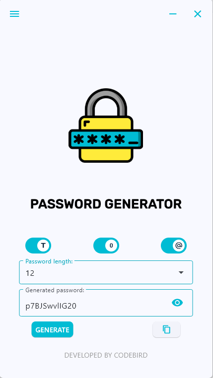

# Password Generator

Простой и удобный генератор паролей, написанный на Python с использованием библиотеки Flet.

---

## 🚀 Функционал

- Генерация паролей длиной 6, 8, 10, 12 или 20 символов.  
- Возможность выбора состава пароля: только цифры, только буквы или буквы + цифры + спецсимволы.  
- Пароль по умолчанию скрыт для безопасности — можно показать/скрыть нажатием на иконку глаза.  
- Кнопка копирования сгенерированного пароля в буфер обмена.  

---

## 🛠 Технологии

- Python  
- Flet (для создания GUI)  

---

## ⚙️ Как запустить

1. Склонируйте репозиторий:  
git clone https://github.com/yourusername/PasswordGenerator.git

2. Установите зависимости (если нужно):
pip install flet

3. Запустите приложение из среды разработки или командной строки:
python main.py

## 📸 Скриншоты

📫 Контакты

* **Telegram:** [@Alex\_Gicheva](https://t.me/Alex_Gicheva)
* **Email:** [alexgicheva@gmail.com](mailto:alexgicheva@gmail.com)

✨ Спасибо за внимание! Надеюсь, этот генератор поможет тебе создавать надёжные пароли быстро и удобно.
